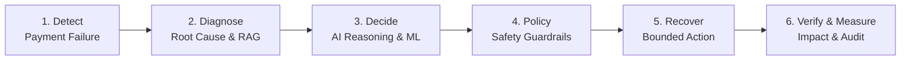

# RecoverAI 🛡️⚡
### Autonomous Revenue Recovery for Failed Digital Payments

> **“Detect lost revenue. Recover it safely. Prove the impact.”**

RecoverAI is an autonomous, policy-bounded revenue recovery platform engineered for the **Razorpay AI Buildathon — Track 3: AI Revenue Recovery**. It transforms failed digital payments into verified recovered revenue through intelligent diagnosis, adaptive recovery strategies, and strict financial guardrails.

Merchants routinely bleed top-line revenue due to transient payment gateway spikes, customer checkout friction, failed subscription recurring charges, and overdue invoice cycles. RecoverAI automates and protects the entire recovery lifecycle:



---

## 🔄 6-Stage Autonomous Lifecycle

RecoverAI operates across an explicit 6-stage autonomous lifecycle:

1. **Detect**: Ingests failed payment webhooks and classifies revenue-at-risk across transactions, subscriptions, and invoices.
2. **Diagnose**: Identifies root causes using error taxonomy and the **Recovery Knowledge Base (RAG)** for payment gateway codes and bank downtime patterns.
3. **Decide**: Formulates adaptive recovery plans powered by **AI decision reasoning** and empirical recovery probabilities (`P(recovery | context)`).
4. **Policy**: Evaluates decisions against strict **deterministic policy guardrails** (e.g., retry limits, customer opt-out, risk caps) before any action can fire.
5. **Recover**: Executes bounded recovery operations via intelligent retry scheduling, Razorpay payment links, or customer-friendly payment alternatives.
6. **Verify & Measure**: Validates payment settlement, records verified financial impact (money recovered), and appends an immutable audit log entry.

---

## 🎯 Selective & Safe Recovery — Not Blind Retries

RecoverAI does **not** blindly retry every failed payment. Repetitive, indiscriminate retries damage merchant standing, irritate customers, and incur network penalties. Instead, RecoverAI acts selectively:

- **Recover Transient Failures**: Automatically recovers soft network drops, temporary bank throttling, and intermittent gateway timeouts.
- **Halt Unsafe / Terminal Cases**: Immediately halts recovery when encountering hard declines (e.g., stolen cards, closed accounts), fraud risk flags, low-confidence predictions, or policy violations.
- **Engage Safe Alternatives**: Triggers safe secondary paths—such as smart payment links or alternative payment method prompts—when direct retries are inadvisable.

---

## 🏛️ Key Platform Highlights

- **Recovery Knowledge / RAG**: Domain-specific retrieval-augmented knowledge covering failure codes, card networks, UPI/netbanking downtime patterns, and recommended recovery tactics.
- **AI Decision Reasoning**: Multi-signal reasoning that weighs error categories, customer payment history, and recovery probability scores to justify every action.
- **Deterministic Policy Guardrails**: Non-bypassable programmatic rules (maximum retry caps, cooldown intervals, value limits, customer suppression) that bound autonomous behavior.
- **Bounded Recovery Execution**: Dual-mode execution engine supporting a zero-risk local recovery simulator and official **Razorpay Test Mode** APIs with signature verification.
- **Verified Financial Impact**: Direct measurement of recovered funds vs. unrecoverable losses to provide clear accounting proof of ROI.
- **Batch Revenue Recovery Evaluation**: Bulk scenario replay and evaluation engine to benchmark recovery strategies across synthetic or historical failure datasets.
- **Complete Audit Trail**: Full timeline logging capturing every incoming signal, diagnostic reason, policy check, and settlement event for total compliance.

---

## 🧪 Verification & Testing Proof

RecoverAI is thoroughly tested across backend services and frontend interfaces:

- **Backend Test Suite**: **57 backend tests passing** (`pytest`) covering API endpoints, policy guardrails, recovery lifecycle, RAG knowledge integration, and batch evaluation.
- **Frontend Production Build**: **Frontend production build passing** (`tsc && vite build`) with clean bundle generation and zero TypeScript errors.

---

## 📁 Repository Structure

```
recovery-ai/
├── backend/            # FastAPI REST backend, database models, policies, services
├── frontend/           # React + Vite + TypeScript fintech dashboard
├── ml/                 # Recovery probability models, feature engineering, notebooks
├── docs/               # Architecture specs, security boundaries, and API docs
├── scripts/            # Automation & dev server scripts
└── tests/              # End-to-end and integration test suites
```

---

## 🚀 Getting Started

### Prerequisites
- Python 3.11+
- Node.js v20+ / npm 10+
- Git

### 1. Backend Setup (macOS / Linux)
```bash
cd backend
python -m venv .venv
source .venv/bin/activate
pip install -r requirements.txt
uvicorn app.main:app --reload --port 8000
```
- API Health Check: `http://localhost:8000/health`
- Interactive OpenAPI Docs: `http://localhost:8000/docs`

### 2. Frontend Setup
```bash
cd frontend
npm install
npm run dev
```
- Dashboard UI: `http://localhost:5173`

---

## 🔒 Security & Compliance

- **Zero Live Secrets**: Real API keys and credentials are exclusively supplied through a local `.env` file, which is strictly excluded from version control (`.gitignore`).
- **Placeholder Templates**: Only sanitized placeholder/example values are provided in `.env.example`.
- **Test Mode & Simulator**: Zero live payment credentials permitted; strictly operates against Razorpay Test Mode and verified local recovery simulators.
- **Webhook Authentication**: Cryptographic webhook signature verification and idempotency keys on all incoming payment events to prevent duplicate executions.
