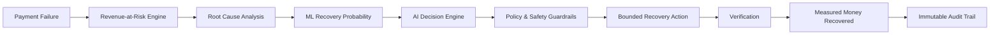

# RecoverAI 🛡️⚡

> **“Detect lost revenue. Recover it safely. Prove the impact.”**

RecoverAI is an autonomous, policy-bounded revenue recovery platform engineered for the **Razorpay Buildathon — Track 3: AI Revenue Recovery**.

Merchants routinely bleed top-line revenue due to transient payment gateway spikes, customer checkout friction, failed subscription recurring charges, and overdue invoice cycles. RecoverAI bridges the gap between payment failures and verified recovery through an end-to-end autonomous lifecycle:



---

## 🏛️ Architecture Highlights

- **Modular Backend**: Built on **FastAPI**, **Pydantic v2**, and **SQLAlchemy 2.0**, isolating domain logic, policy checks, ML inference, and payment integrations.
- **Explainable Revenue-at-Risk**: Deterministic, non-fabricated classification into *Recoverable*, *Uncertain*, and *Unlikely to Recover*.
- **Interpretable Machine Learning**: Baseline probability models ($P(\text{recovery} \mid \text{features})$) evaluated on honest held-out test splits.
- **Bounded Policy Enforcement**: Absolute stopping rules (e.g., maximum retries, customer refusal, low confidence threshold) that AI agents cannot bypass.
- **Dual Execution Modes**: High-fidelity local recovery simulator and official **Razorpay Test Mode** APIs with webhook signature verification.
- **Fintech Dashboard**: High-density React + Vite + TypeScript interface tracking recoverable revenue, active incidents, and complete transaction audit timelines.

---

## 📁 Repository Structure

```
recovery-ai/
├── backend/            # FastAPI REST backend, database models, policies, services
├── frontend/           # React + Vite + TypeScript fintech dashboard
├── ml/                 # Recovery probability models, feature engineering, notebooks
├── docs/               # Architecture specs, security boundaries, and API docs
├── scripts/            # Automation & dev server scripts
└── tests/              # End-to-end and integration test suites
```

---

## 🚀 Getting Started

### Prerequisites
- Python 3.11+
- Node.js v20+ / npm 10+
- Git

### 1. Backend Setup
```powershell
cd backend
python -m venv .venv
.venv\Scripts\activate
pip install -r requirements.txt
uvicorn app.main:app --reload --port 8000
```
Verify health: `http://localhost:8000/health`

### 2. Frontend Setup
```powershell
cd frontend
npm install
npm run dev
```
Access dashboard: `http://localhost:5173`

---

## 🔒 Security & Compliance
- Zero live payment credentials permitted; strictly Razorpay Test Mode and verified local simulators.
- All secrets strictly sourced via `.env` (guaranteed excluded from version control).
- Webhook signature authentication and idempotency keying on all payment events.
